# NervosHackathon

Setup A Local CKB Node And CKB Indexer For The Testnet
## Gitcoin: 0
1. Setup ckb Node:
  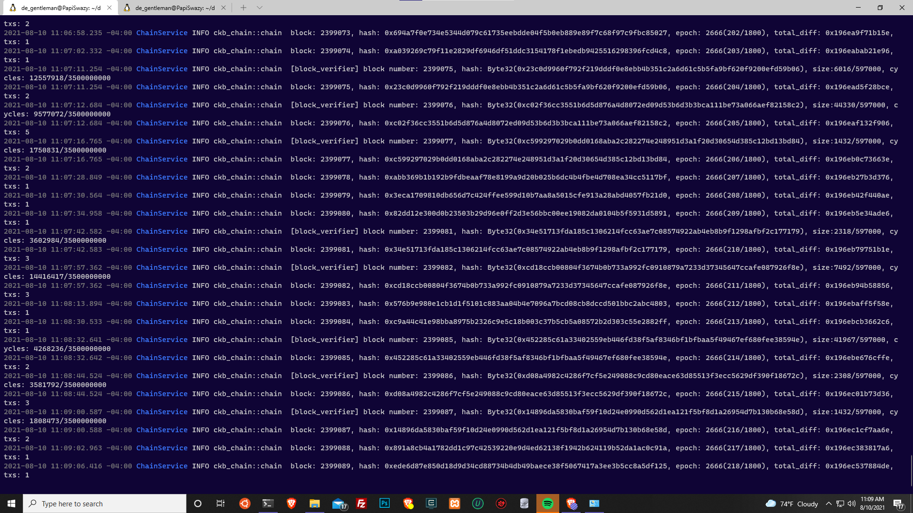
2. Setup  a cskb indexer
  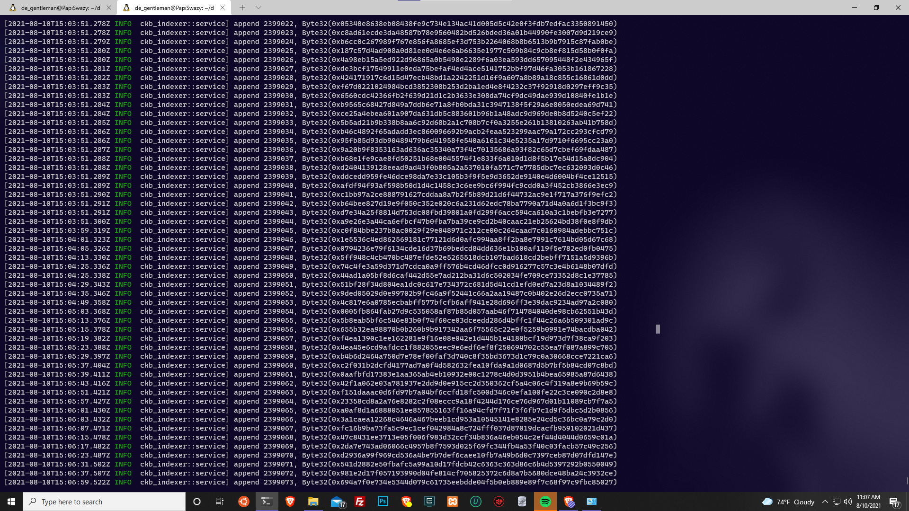

Create A Godwoken Account On The EVM Layer 2 Testnet
## Gitcoin: 1
1. account created:
  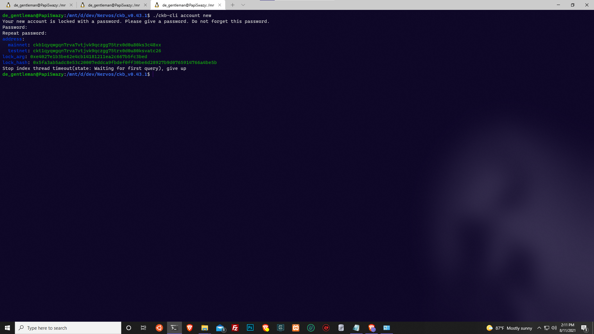
2. Layer One founded account
  [clickhere](https://explorer.nervos.org/aggron/address/ckt1qyqwgqn7rva7vtjvk9qczgg75trx0d0u80ksvatc26)
3. Completed Subbmision on layer 2 
  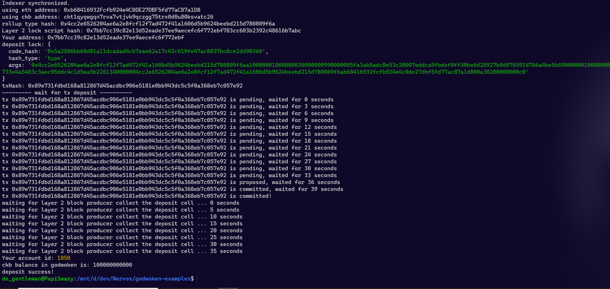

## gitcoin: 2
1. Deployed Smart Contract:
	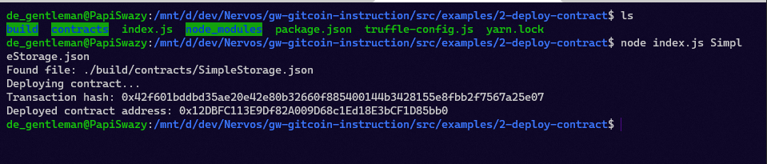
2. Transaction hash: 0x42f601bddbd35ae20e42e80b32660f885400144b3428155e8fbb2f7567a25e07
3. Deployed contract address: 0x12DBFC113E9Df82A009D68c1Ed18E3bCF1D85bb0

## gitcoin: 3
1. Succufully issued contract
  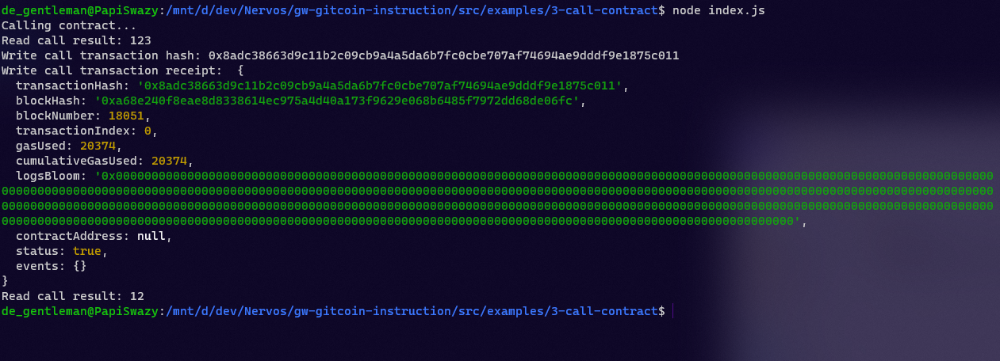
2. transactionHash: '0x8adc38663d9c11b2c09cb9a4a5da6b7fc0cbe707af74694ae9dddf9e1875c011'
3. Deployed contract address: 0x12DBFC113E9Df82A009D68c1Ed18E3bCF1D85bb0
4. > [
    {
      "inputs": [],
      "stateMutability": "payable",
      "type": "constructor"
    },
    {
      "inputs": [
        {
          "internalType": "uint256",
          "name": "x",
          "type": "uint256"
        }
      ],
      "name": "set",
      "outputs": [],
      "stateMutability": "payable",
      "type": "function"
    },
    {
      "inputs": [],
      "name": "get",
      "outputs": [
        {
          "internalType": "uint256",
          "name": "",
          "type": "uint256"
        }
      ],
      "stateMutability": "view",
      "type": "function"
    }
  ]

## Gitcoin: 04 
1. [Link to layer 1 funded](https://explorer.nervos.org/aggron/transaction/0x0c461d26faa443effa1494199633079ec610bc0272fcd138054cfdbede5c8d9d)
2. Screenshot of creating SUDT tokens on layer 1 
  
3. [Link to the trasnsation ID created by sudt-cli](https://explorer.nervos.org/aggron/transaction/0x3adf42f5ac88cc8a083eb21c149c24397442388d6d7c92cd9ff0a5c8aa0077eb)
4. sudt id: 1877

## Gitcoin: 05
1. Console after deploying smart contract
  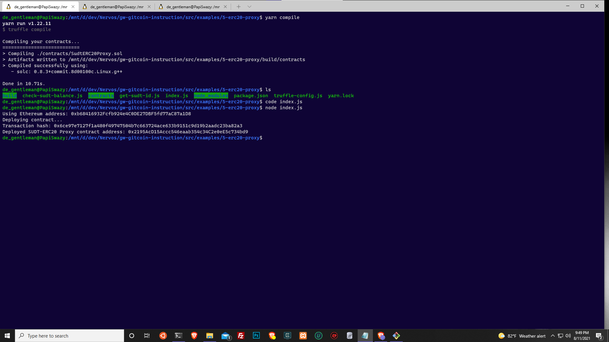
2. Proxy contract address: 0x2195AcD15Accc546eaab354c34C2e0eE5c734bd9
3. Checking SUDT bal
  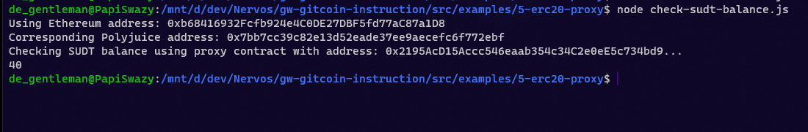
4. Ethereum address: 0xb68416932Fcfb924e4C0DE27DBF5fd77aC87a1D8

## Gitcoin: 06 
1. Succufully Genereate Deposit Receiver Address 
  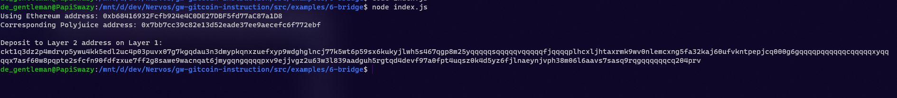
2. Deposit Reciever
  > ckt1q3dz2p4mdrvp5ywu4kk5edl2uc4p03puvx07g7kgqdau3n3dmypkqnxzuefxyp9wdghglncj77k5wt6p59sx6kukyjlwh5s467qgp8m25yqqqqqsqqqqqvqqqqqfjqqqqplhcxljhtaxrmk9wv0nlemcxng5fa32kaj60ufvkntpepjcq000g6gqqqqpqqqqqqcqqqqqxyqqqqx7asf60w8pqpte2sfcfn90fdfzxue7ff2g8sawe9wacnqat6jmygqngqqqqpxv9ejjvgz2u63w3l839aadguh5rgtqd4devf97a0fpt4uqsz0k4d5yz6fjlnaeynjvph38m06l6aavs7sasq9rqgqqqqqqcq204prv
3. [Etherscan explorer](https://rinkeby.etherscan.io/tx/0x10d7412b0c78caad7970b429ef2291afde46a5b980d4909be71834a05c88ac22)
4. [Nervos explorer](https://explorer.nervos.org/aggron/transaction/0x9a4d10fc85edb3189ee569600c21cfe96244c27d9d653b19a03e424e13f3f480)

## gitcoin: 07
  1. [my Project](https://github.com/shpintz/CryptoZombie)
   - images
    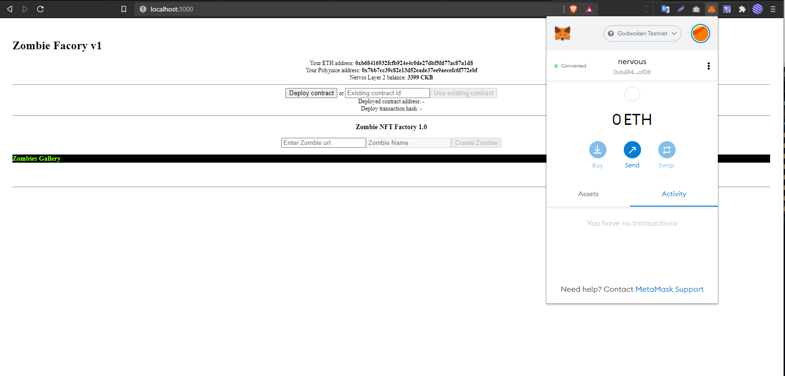
    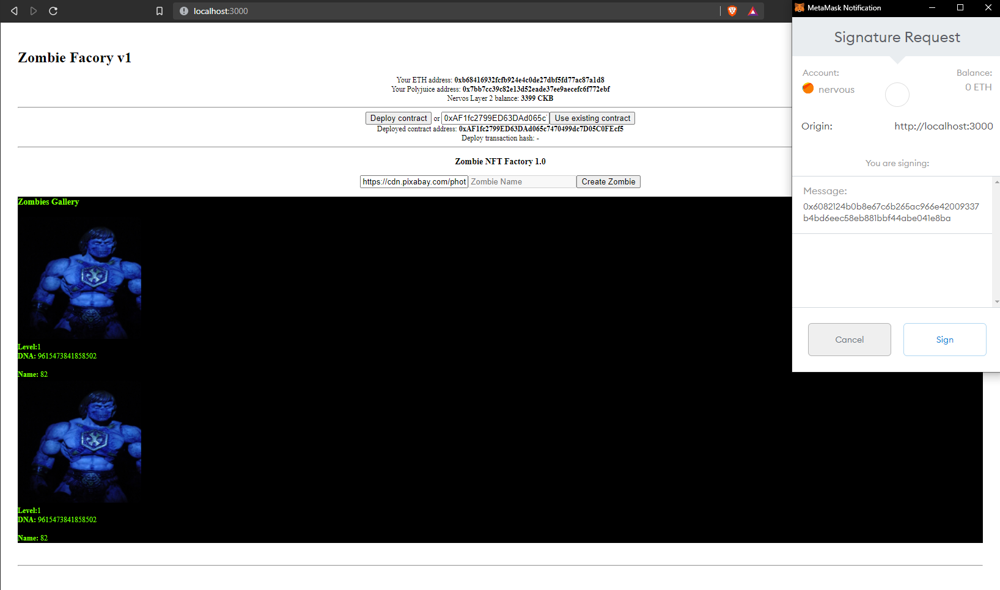
    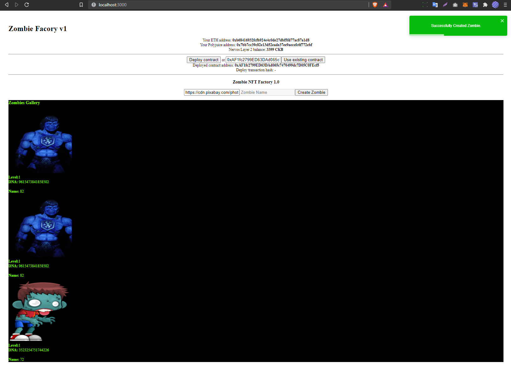
  2. Deployed contract address: 0xFBc25d3a2e5f7E9aeF5f9cb77E2252F15c8305F8
  3. Deploy transaction hash: 0x8b4fdba35d148c50c0f0fdf917041f53ff31af0855c19515d8511767d554f1920x622dfd9a430d51e1948ec7b5bb056e5293504392bef67d2e7cba2dc2d064cc9b

## gitcoin: 08
  Task Submission:
1. 
2. SUDT_PROXY_CONTRACT_ADDRESS : 0x2195AcD15Accc546eaab354c34C2e0eE5c734bd9
3. [project](https://github.com/shpintz/CryptoZombie/tree/task-8)
4. [hackathon](https://github.com/shpintz/NervosHackathon)

## gitcoin: 12
 checkout [notes](https://github.com/shpintz/NervosHackathon/blob/main/gitcoin-12/Document%20Porting%20an%20Existing%20Ethereum%20dApp%20to%20Poly%20679f056aed2c4564b9e43d983fb3616f.md)
 video [here](https://youtu.be/xMG0vwhBW5Q)
